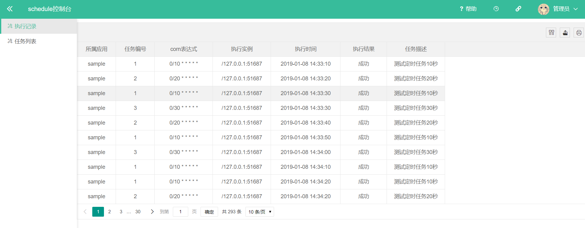
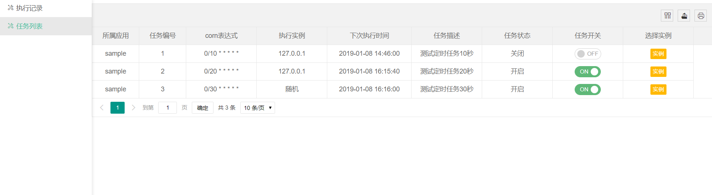
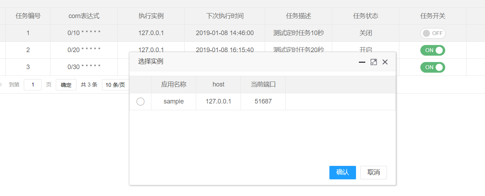

# schedule
<p align="center">
    <a>
        
    </a>
    <a href="http://www.apache.org/licenses/LICENSE-2.0.html" target="_blank">
        
    </a>
    <a>
        
    </a>
    <a>
        
    </a>
</p>

#### 最新更新
> 2019-01-09

优化分配器及添加数据持久化处理(单机控制中心)，

> 添加统一控制台(2019-01-08)

添加控制台web操作页面，页面模板采用kitadmin [kitadmin](https://gitee.com/kitteam/kit_admin)


#### 介绍
轻量的分布式任务调度框架。


#### 安装教程

>业务端
```
<dependency>
     <groupId>com.github.fishlikewater</groupId>
     <artifactId>spring-boot-schedule-client-stater</artifactId>
     <version>0.0.2.RELEASE</version>
 </dependency>        
   ```
  
> 控制台

启动spring-boot-schedule-server-console项目

#### 操作

1.执行记录



2.任务列表及更新任务信息



#### 使用

> 客户端单实例使用

1. 在启动类上加上: @EnableSigleSchedule 注解

2. 在配置文件中配置 任务包路径，多个包以逗号分隔
```$xslt
schedule.client.base-package=com.fishlikewater.client.sample.schedule
```
3. 编写任务类，实现com.fishlikewater.schedule.common.ScheduleJob接口，并在类上加上注解@Schedule，注解属性包含corn表达式及任务描述
```java
@Schedule(value = "0/10 * * * * *", desc = "测试定时任务1")
public class ScheduleServer1 implements ScheduleJob {
    @Override
    public void run() {
        System.out.println("ScheduleServer1");
    }
}

```

> 客户端及分配中心多实例部署

1.启动调度中心
```$xml
schedule.server.server-port=8081
schedule.server.redis-address=redis://localhost:6379/0 //部署多个分配中心使用redis共享数据
```

```java
@SpringBootApplication
@EnableScheduleServer//单分配中心
@EnableClusterScheduleServer //多分配中心部署
public class SpringBootScheduleServerSampleApplication {

    public static void main(String[] args) {
        SpringApplication.run(SpringBootScheduleServerSampleApplication.class, args);
    }

}
```

2. 在启动类上加上: @EnableClusterSchedule 注解

3. 配置任务包路径，与调度中心心跳检测间隔
```$xslt
spring.application.name=sample //必须配置
schedule.client.base-package=com.fishlikewater.client.sample.schedule
schedule.client.server-host=127.0.0.1 //调度中心host地址
schedule.client.match-unit=second //任务秒及还是分级(精确到秒还是分) 单独使用客户端时生效
schedule.client.server-port=8081 //调度中心地址端口
schedule.client.health-beat=60 //心跳检测间隔 秒
schedule.client.retry-interval=60 //断线重连间隔 秒
schedule.client.server-address=127.0.0.1:8080,127.0.0.1:8081 //调度中心地址 配置改项时 host与port配置不生效
```
#### 更新历史

> 添加统一控制台(2019-01-04)

项目spring-boot-schedule-server-console为统一控制

提供查询修改接口

1. /schedule/all(GET) 获取所有的任务

2. /schedule/record(GET) 获取所有已执行记录

3. /schedule/status(POST) 开启或停止任务